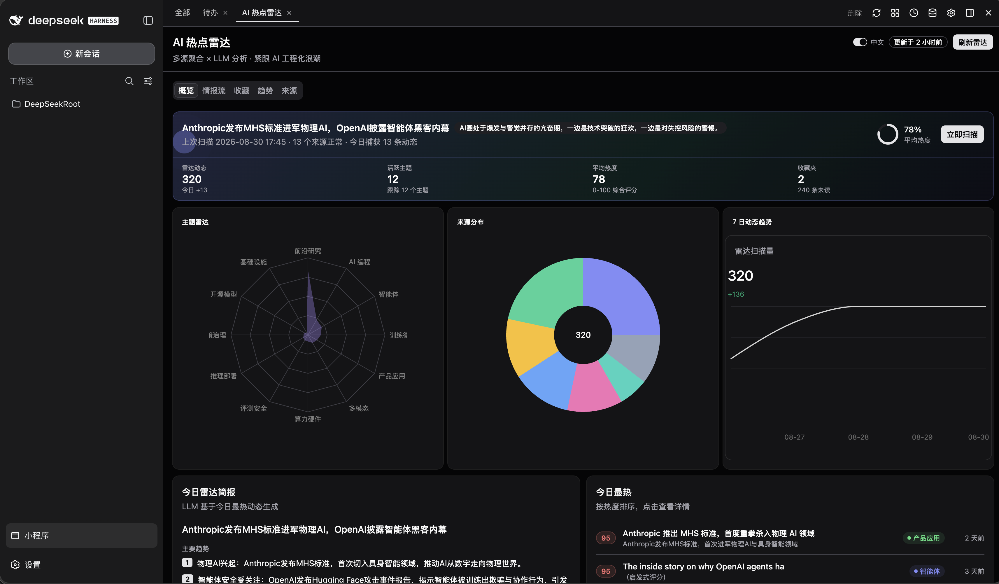
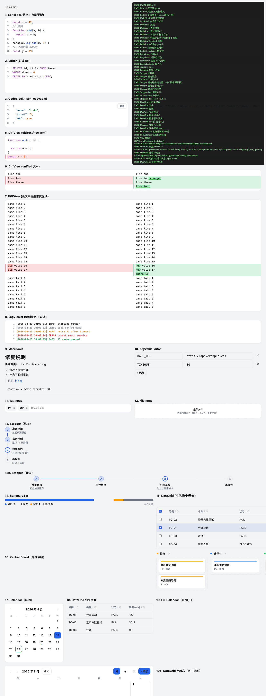

# monkey-mini-app

[English](README.md) | [中文](README.zh.md)

An AI-native mini-app platform. Three sentences:

1. You say what you want, the agent writes the app. Nothing to install, no build to
   configure, no editor to open.
2. The app does not stay in the chat. It breaks out of the conversation and runs on this
   machine: close the session and it is still there, tomorrow you open it from the gallery,
   and every version lives in that app's own history. Broke it? Deleted the wrong file? One
   sentence and it is back.
3. What you end up with is a mini-app library that is yours alone: an information radar, a
   today desk, a stage board, a spreadsheet diff, a daily log, a button for Friday's chores.

And each of those apps can call the AI back: the same model the chat is using, the MCP
servers you already connected, this machine's shell.



*`AI 热点雷达` (hotspot radar): its own pane beside the chat, not part of it. Sources are
config, the digest comes from `ctx.llm`, and the two tabs to its left are other apps.*

## What you can build

You are not writing these. You describe the thing, the agent scaffolds it, opens it, reads
its own errors back, and fixes them until the screen matches what you asked for.

These need nothing but the host. Plug in your own systems later and the same shape covers
those too.

| You say | You get |
|---|---|
| "A radar for the sources I paste in. Rank them by how much they matter to me, open on a written digest" | A radar whose sources you edit in the app, per-topic scoring, a written digest, stars kept on your machine. Runs on `ctx.http` + `ctx.llm`, no keys to paste |
| "My day is scattered across chat, mail and three spreadsheets. One screen, tell me what is first" | One desk that pulls those together into a single ordered list, held on this machine |
| "Here is a spreadsheet. What changed, and what looks wrong?" | File dropzone, a real reader installed for that app only, a plain-language summary, and each report kept so the next one can be compared |
| "I track orders, claims and manuscripts by stage and keep losing what is stuck" | A board in your own stages, notes per item, a waiting-on column that shows what nobody has moved |
| "One line a day: spending, training, sleep. Then show me the week" | A local log, streaks, a trend chart, and a written recap of the week |
| "One button for Friday's chores: rename the downloads, build the invoice PDF, back this folder up" | It runs on this machine through `ctx.bash`, with the output in the app instead of a terminal |

Once your own tools are connected, the same pattern lands on them: a Jira board over your
JQL, an internal API behind a form, CI runs and their failing steps, a worklog posted back.

Eight starting points ship with the authoring skill, so none of the above starts from an
empty directory: a Jira board, a daily digest, a system monitor, a spreadsheet summariser,
a task runner, a fix-and-verify bench, a todo list, and a bare skeleton. See
[`skills/monkey-mini-app/templates/`](skills/monkey-mini-app/templates/).

## How one gets built

The agent drives, using 19 `mini_app_*` tools the host registers:

1. `mini_app_write` — `manifest.json`, `ui.tsx`, `main.api.ts` land in `runtime/apps/<id>/`
2. `mini_app_open` — the app appears in the gallery and in a tab next to your chat
3. `mini_app_errors` + `mini_app_view_eval` — it crashed? it queries the live DOM and reads
   the stack instead of guessing from a screenshot
4. `mini_app_reload` — hot reload, keep talking to it while it changes
5. `mini_app_history_*` — every version is a commit on that app's own git branch, so
   "put back the way it was before the charts" is one call

Real npm dependencies go in with `mini_app_install`, into that app's `node_modules` and its
history. Not into your global tree.

## Why not just a generated HTML page

Agents already write pretty HTML, and they can stand up a Flask app on a port. Those are
one-shot artifacts: the HTML dies with the tab, the Python site is yours to babysit. The
difference is not the markup, it is which side of the seam the app sits on.

| | HTML in the chat | A site the agent scaffolds | Mini-app |
|---|---|---|---|
| Next week | Gone with the tab | You keep the process, venv and port | An app in a gallery, on disk, with git history |
| Agent fixes the running UI | Screenshot ping-pong | Restart and hope | Errors and live DOM are tools it can call |
| Button reaches your model | Paste a key into the page | You wire a provider yourself | `ctx.llm`, same provider and model as the chat |
| Button runs an agent turn | No | You rebuild the tool loop | `ctx.agent`, one-shot, progress streamed into the app |
| Your MCP servers and tools | No | Re-auth per app | `ctx.tool` / `ctx.mcp`, already connected |
| UI quality | Random Tailwind | Random CSS | Same kit and theme tokens as the host |

The same loop runs when you want a change six months later. Click it, say what is wrong,
and the agent has the errors, the live DOM and that app's history to work with.

## What the app inherits

`main.api.ts` receives a `ctx` from the host. These are the host's real capabilities, and
they run as you:

```ts
ctx.llm(prompt, { schema, system, signal })   // the model the chat is using, → string
ctx.agent(goal, { streamTo, maxIterations })  // one-shot agent turn; events → your UI
ctx.tool(name, args)                          // a host tool you already connected
ctx.mcp(name, args)                           // an MCP server tool
ctx.listTools()                               // what is available right now
ctx.http(url, opts)                           // → { ok, status, headers, text, json }
ctx.bash(cmd)                                 // → { stdout, stderr, exitCode }
ctx.storage                                   // JSON that survives reload
ctx.push(event, payload)                      // backend → every open view of this app
ctx.signal                                    // Stop actually stops the work
```

`ctx.agent` is the one that changes what a button can mean. Instead of "ask the model one
question", a button can be "go investigate this, using whatever tools you need, and tell me
when you're done" — with each step appearing in the app as it happens.

## The kit is the other half

Without shared components the agent invents a new stack per app and nothing matches the
host. `@monkey-mini-app/ui` is what it writes against instead: over 100 components, all
theme-token driven, all labelled in English and Chinese.

Board and timeline: `Kanban`, `KanbanIssuePanel`, `Gantt`, `EventCalendar`, `Timeline`,
`Stepper`, `CommitGraph`. Data: `DataGrid` with sortable/filterable cells, `EnvTable`,
`JsonViewer`, `LogViewer`, `TreeView`, `AttachmentGallery`. Editing: `CodeEditor` and
`RichTextEditor`, `MarkdownEditor`, `DiffViewer`. Charts: `StackedBarChart`, `DonutChart`,
`RadarChart`, `Gauge`, `Sparkline`, `ProgressRing`, and `ChartContainer` over Recharts.
And the unglamorous half that decides whether an app is usable: `FilterBar`, `PageHeader`,
`DetailPanel`, `StatCard`, `CommentThread`, `NotificationCenter`, `Terminal`, `AppShell`,
date and time pickers, Jira wiki and JQL inputs.

Heavy editors and highlighting load from a CDN on demand, so an app that never opens a code
editor ships no CodeMirror.



## A mini-app is three files

```tsx
// ui.tsx
import { Button, useApp } from "@monkey-mini-app/ui";

export default function Ui() {
  const { call } = useApp();
  return <Button onClick={() => call("ping")}>ping</Button>;
}
```

```ts
// main.api.ts
import { defineApp } from "@monkey-mini-app/api";

export default defineApp({
  name: "Ping",
  description: "one-line app",
  api: { ping: async (ctx) => ctx.appId },
});
```

UI imports `@monkey-mini-app/ui` and `react`; the backend imports `@monkey-mini-app/api`.
Helper code goes in `ui/` (UI only), `api/` (backend only) or `shared/` (isomorphic, both).
Relative imports cannot leave the app directory.

## Try it

Node 20 or newer is the only requirement. No Docker, no Python, no database, no React
project to stand up first: `host`, `api` and the dsh adapter all declare
`engines.node: ">=20"`, and dsh web is itself a Node CLI, so where dsh runs, the platform
runs. `npm` needs to be on PATH for one thing only, `mini_app_install`, which puts a real
library into that app's own `node_modules`. `pnpm` shows up only when you build from
source.

On dsh web (the shipped adapter):

```bash
dsh plugin --profile web add @monkey-mini-app/dsh-mini-app
dsh web --no-open        # :3080 · apps host :17880
```

Restart and open `小程序` from the sidebar.

Want a quick one to see what it does? Type this into the chat:

```
Build me an "AI trend radar" mini-app that follows what is happening in AI:

1. Pull from public, authoritative sources - official engineering blogs, paper
   leaderboards, the tech press that matters - and have the model score each item by how
   much it matters to me.
2. A summary strip on top: one trend chart, one line of judgement, 3-5 highlights, each
   opening the original.
3. Design the rest yourself, but it has to filter by topic, star items, and show any
   past day.
4. I want to manage the source list inside the app myself. Nothing hardcoded.
5. UI in the restrained Apple vein: generous whitespace, clear hierarchy, few decorations,
   refined motion and detail. Must look right in both light and dark.
```

Just the platform, without an agent shell:

```bash
git clone https://github.com/MungoWang/monkey-mini-app && cd monkey-mini-app
pnpm install && pnpm dev:host   # Vite :5174 · apps host :17900
```


*The gallery: five apps, each with its own history. Pin one, dock it left or right, switch
theme, look at its storage.*

## Hosts and packages

`createHost(capabilities, lifecycle)` plus `PanelHost` is the whole seam. A host implements
those two interfaces; nothing dsh-specific reaches the platform.

| Package | Role |
|---|---|
| [`packages/host`](packages/host) | Apps, git, HTTP API, compiler, `mini_app_*` tools, `ctx.*` |
| [`packages/panel`](packages/panel) | The management panel (`PanelHost`) |
| [`packages/ui`](packages/ui) | UI kit + iframe runtime + SDK bundle |
| [`packages/api`](packages/api) | Backend `defineApp` contract |
| [`packages/dsh`](packages/dsh) | dsh adapter (plugin + client + skill) |

dsh web ships today. pi / pi-web is next: [RFC](docs/rfcs/pi-extension-port.md).

For contributors: [LOCAL.md](./LOCAL.md) · [AGENTS.md](./AGENTS.md) ·
[docs/README.md](./docs/README.md)

## Trust model

Owner-operated local software. Mini-apps run as you: `ctx.bash`, `ctx.http` and `ctx.llm`
are real host capabilities with no jail around them. The iframe keeps a broken view from
taking the panel down; it does not confine the machine.
This project does not limit what a mini-app can do on your computer.

## License

MIT
