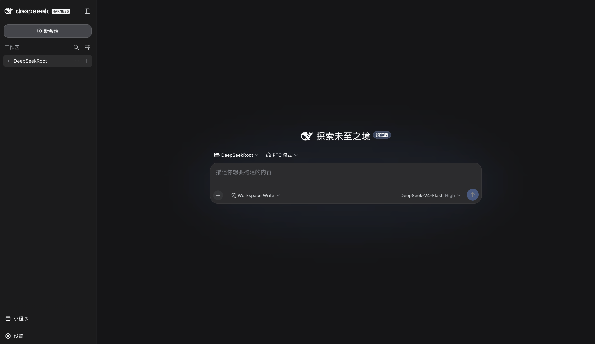
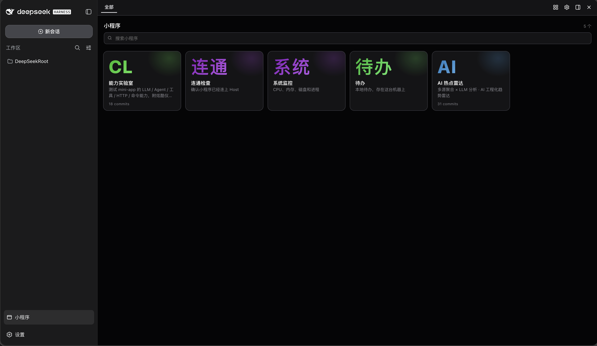
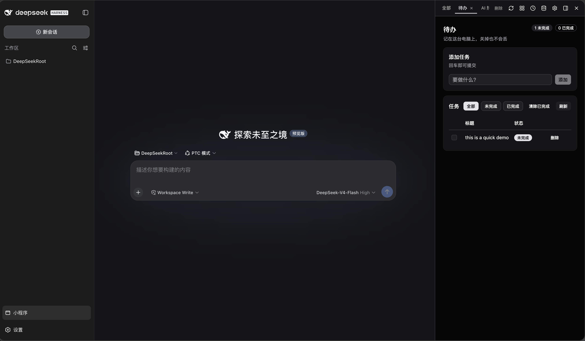

# monkey-mini-app

[English](README.md) | 中文

**面向 AI 的小程序平台** — 不等于对话里的一个花哨 HTML 文件。是装在本机、钉在对话旁边的真应用，而且能用上 **agent 已经接好的同一套模型和工具**。

产品是平台本身（runtime + 面板 + SDK）。Agent 壳（今天是 dsh，之后是 pi）只是 adapter。



## 为什么不是一份生成的 HTML，也不是本地 Python 站？

Agent 早就能写出漂亮的 HTML，也能拉起一个连数据库的 Flask/FastAPI。那是**一次性产物**。小程序要解决的是：那个产物做不到、除非你自己变成平台的事。

| | 对话里的 HTML | Agent 写的本地网站 | 小程序 |
|---|---|---|---|
| 明天还在 | 关标签就没了 | 你得看着进程、venv、端口 | 一等公民：落盘 + git + 面板 |
| Agent 能修正在跑的 UI | 来回截图 | 重启碰运气 | `reload` → 错误卡片 → 实况 `view_eval` |
| 按钮调用**你的**模型 | 自己贴 API key | 自己接 OpenAI | `ctx.llm` — 和宿主同一套模型，可结构化 JSON，可取消 |
| 按钮跑一轮**真 agent** | 不能 | 自己搓 tool loop | `ctx.agent` — 一次性、和聊天会话隔离，进度流进 app |
| 用你已经接好的 SKILL/ MCP / 工具 | 不能 | 每个 app 重新鉴权 | `ctx.tool` / `ctx.mcp` / `ctx.listTools()` — 宿主现成的工具带 |
| 本机 / 网络 | 不能 | 自己管 `requests` 和密钥 | `ctx.bash` / `ctx.http`，身份就是机主 |
| 需要一个真的库（表格格式、消息队列客户端、厂商 SDK） | 困在浏览器里 | 一堆你得一直维护的依赖 | `mini_app_install` 只装进**这个 app** 的 `node_modules`（不跑生命周期脚本，lockfile 进它的历史） |
| 不用自造技术栈的 UI | 随机 Tailwind | 随机 CSS | SDK 里的套件 + 模型被教会的 theme token |
| 很多个 app，就在对话旁边 | 一堆浏览器标签 | 一堆端口 | 画廊、钉住、左右停靠 |

**住在宿主里的程序**：生成、使用、再改，不用每次从一份新 HTML 重来。

## 跑起来的 app 继承什么

`main.api.ts` 拿到宿主 `ctx`：聊天 agent 在用的那套模型、工具和本机能力。不是玩具沙箱：

**模型。** `ctx.llm(prompt, { schema, system, signal })` 就是聊天已经在用的那套模型。给一行分类、起草回复、抽 JSON——返回 string（`schema` 结果再 `JSON.parse`）。长任务用 `ctx.signal` 响应停止。不用再塞一套 SDK 或 key。

**Agent。** `ctx.agent(goal)` 拉起一轮**一次性**宿主 agent（不是当前聊天会话）：可以循环调工具，把状态/工具事件流进 UI（`streamTo` + `useApp().on`），结束即销毁。仪表盘上的按钮可以是「去查一下」，而不是「再打一次补全」。

**你已经接入的工具。** MCP 和宿主 tools 以 `ctx.tool` / `ctx.mcp` / `ctx.listTools()` 出现。app 不用再声明一遍。聊天 agent 能打的 Jira、浏览器、内网 API，小程序按钮同样能打。

**本机。** `ctx.http`、`ctx.bash`、`ctx.storage` —— 网络、这台电脑、重载还在的 JSON。信任模型和写出它的那个 agent 相同（见下）。

这条环路——**agent 做出 app，app 再回调模型和工具带**——才是产品。

## 创作、面板、宿主

**Agent 原生创作。** skill + `mini_app_*` 工具 + `@monkey-mini-app/ui`（表格、图表、编辑器、看板、主题）。模型不用自造 React/Vite/npm 就能搭出 `manifest.json` + `ui.tsx` + `main.api.ts`。热重载、运行时错误、实况 DOM 查询把回路闭合，不需要人盯着。

**统一管理面板。** 画廊、打开/钉住/侧栏、主题、历史、存储、重载。一边聊天，一边用 app。

**宿主无关。** `createHost(capabilities, lifecycle)` + `PanelHost`。dsh web 是已发布的 adapter；pi / pi-web 是下一个（[RFC](docs/rfcs/pi-extension-port.md)）。`host` / `panel` / `ui` / `api` 不依赖 dsh。


*dsh adapter 里的画廊——实现接缝的任何宿主都能跑同一批 app。*


*钉在侧栏：左对话，右小程序。*

## 小程序长什么样

```tsx
// ui.tsx
import { Button, useApp } from "@monkey-mini-app/ui";

export default function Ui() {
  const { call } = useApp();
  return <Button onClick={() => call("ping")}>ping</Button>;
}
```

```ts
// main.api.ts
import { defineApp } from "@monkey-mini-app/api";

export default defineApp({
  name: "Ping",
  description: "one-line app",
  api: { ping: async (ctx) => ctx.appId },
});
```

UI import `@monkey-mini-app/ui`（+ `react`）；后端 import `@monkey-mini-app/api`。
辅助代码放 `ui/`（仅 UI）、`api/`（仅后端）、`shared/`（同构纯净，两边都行）；
相对路径不得跳出 app 目录。
创作 skill：`skills/monkey-mini-app/`。

## 试用

只跑平台（不接 agent 壳）：

```bash
pnpm dev:host # Vite :5174 · apps host :17900
```

接到 dsh web（当前 adapter）：

```bash
dsh plugin --profile web add @monkey-mini-app/dsh-mini-app
dsh web --no-open # :3080 · apps host :17880
```

重启 `dsh web` → **小程序**。不用再装别的 npm 包。

## 开发

**[LOCAL.md](./LOCAL.md)** · **[AGENTS.md](./AGENTS.md)** · **[docs/README.md](./docs/README.md)**

| 包 | 角色 |
|----|------|
| `host` | 平台：apps、git、HTTP、编译、`mini_app_*`、`ctx.*` |
| `panel` | 管理面板（`PanelHost`） |
| `ui` | UI 套件 + iframe `/mma/runtime.js` + `/mma/sdk.js` |
| `api` | 后端 `defineApp` 合同（host 注入） |
| `dsh` | dsh adapter（插件 + skill） |

## 信任模型

这是**给机主用的本机软件**。小程序以后端身份跑，权限就是宿主进程。`ctx.bash`、`ctx.http`、`ctx.llm` 是真正的宿主能力，不是沙箱——这正是产品的点。UI iframe 只把崩溃的视图和面板隔开，并不隔离这台机器。本项目不宣称会限制小程序在你电脑上能做什么。

## License

MIT
