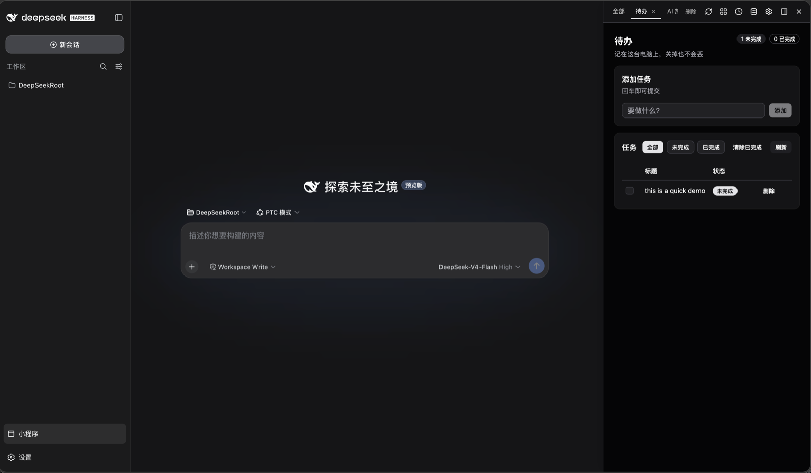
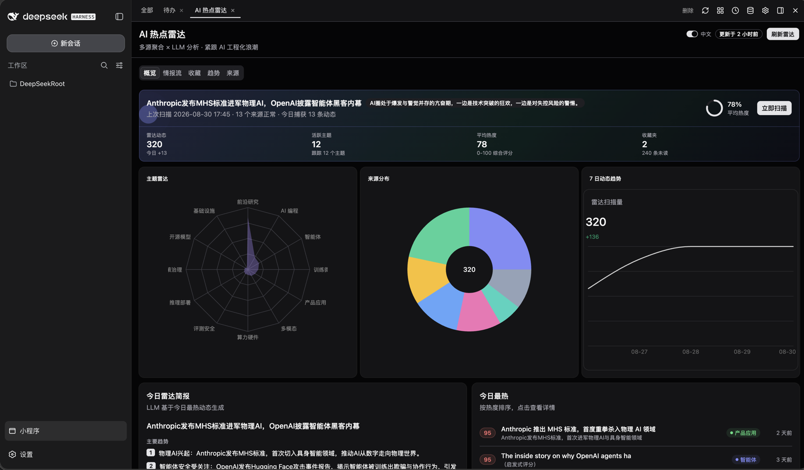

# @monkey-mini-app/dsh-mini-app

dsh **adapter** for the [monkey-mini-app](https://github.com/MungoWang/monkey-mini-app) platform: a「小程序」rail on [DeepSeek Harness](https://github.com/deepseek-ai) web so a model can create, run, and pin React mini-apps (`manifest.json` + `ui.tsx` + `main.api.ts`) in the sidebar.

The platform itself is host-agnostic (`createHost`). This package is one host, not the product.


*After install, the sidebar gains a「小程序」entry.*

## What it does

- One `mini_app_register` and the host runs a mini-app on this machine.
- Sidebar gallery: open, switch, dock, theme.
- Each app has `ui.tsx` + `main.api.ts` (`ctx.llm` / `http` / `bash` / `agent` / `storage` …).
- One plugin ships the platform (AppsManager / git / Hono / UI compile / tools) + React panel + authoring skill.


*Gallery.*


*An open mini-app (LLM / agent / tools / net / shell).*


*Docked (Todo): chat left, app right.*


*A denser mini-app (multi-source + LLM + charts).*

## Install

```bash
dsh plugin --profile web add @monkey-mini-app/dsh-mini-app
```

Then:

```bash
dsh web --no-open   # http://127.0.0.1:3080 ; apps host default :17880
```

First start bootstraps a full `host.json`. The「小程序」entry appears in the sidebar.

## Use

1. **Open**: sidebar「小程序」→ any app.
2. **Generate**: ask the model to build an app; it follows the bundled skill (`skills/monkey-mini-app/templates/`).
3. **Call**: `defineApp({ api })` in `main.api.ts`; `useApp()` `call(method, args)` in `ui.tsx` — both imported from `@monkey-mini-app/sdk`.
4. **Debug**: `mini_app_call`, `mini_app_reload`, `mini_app_open`.

## UI kit: convenience, not a spec

`@monkey-mini-app/ui` (via the SDK) is optional. Mix with native elements + Tailwind. See the skill.

## Notes

- **Plugin entry**: `apply(ctx, config?)` (Cordis), `name="monkey-mini-app"`, `inject=["tools"]`, plus `DshCapabilities` / `DshLifecycle` / `DshThemeResource`.
- **client**: `@monkey-mini-app/dsh-mini-app/client` exports `FooterButton` / `createMiniAppPanel` / `appFrameUrl` / `appsOrigin`.
- **deps**: `@monkey-mini-app/host` / `panel` / `ui` are runtime `require` (external). After publish they resolve from npm.
- **config**: missing `host.json` is bootstrapped; present-but-corrupt still fails loud.
