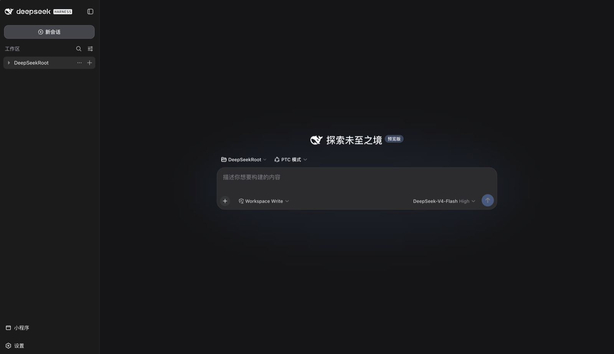
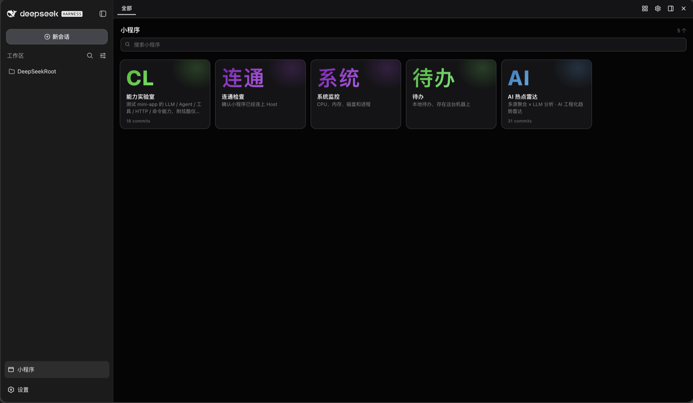
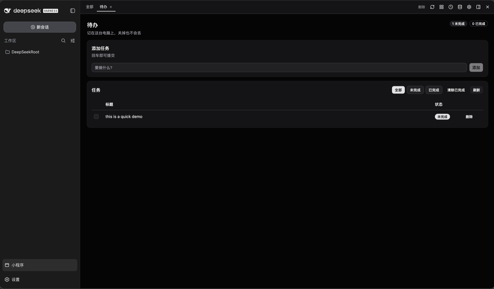

# @monkey-mini-app/dsh-mini-app

给 [DeepSeek Harness](https://github.com/deepseek-ai) 加一条 **「小程序」跑道**：让模型可以在对话里直接创建、运行、打开一个个小的 React 应用（`manifest.json` + `ui.tsx` + `main.api.ts`），它们以独立窗口的形式停在侧栏。


*安装后侧栏多出「小程序」入口。*

## 它能做什么

- 模型（或你）用一行 `mini_app_register` 就能**秒建一个 mini-app**，Host 在本机把它跑起来。
- 侧栏「小程序」面板是个**应用画廊**：打开、切换、钉到侧边、设置主题。
- 每个 mini-app 有独立的 `ui.tsx`（UI）+ `main.api.ts`（`ctx.llm`/`ctx.http`/`ctx.bash`/`ctx.agent`/`ctx.storage`…）。
- 打包即用：一个 dsh 插件就带齐 Host（AppsManager / git / Hono / UI 编译 / tools）+ React 面板 + 生成 skill。


*小程序画廊（5 个示例 app）。*


*打开一个 mini-app（能力实验室：LLM / Agent / 工具 / 网络 / 命令）。*

## 安装

```bash
pnpm add @monkey-mini-app/dsh-mini-app
```

然后启用插件（Cordis）并打开 dsh web：

```bash
dsh web --no-open   # http://127.0.0.1:3080 ；apps host 默认 :17880
```

首次运行请先初始化运行时配置：

```bash
bash scripts/install-dsh-mini-app.sh
# 或手动：pnpm exec tsx scripts/mma-init.ts
```

## 使用

1. **打开**：侧栏点「小程序」→ 打开任一 app。
2. **生成**：让模型「做一个 xxx 小程序」，模型会按内置 skill 生成 `manifest.json` + `ui.tsx` + `main.api.ts`（模板在 `skills/monkey-mini-app/templates/`）。
3. **调用**：mini-app 的 `main.api.ts` 用 `defineDashboard({ api })` 暴露方法；`ui.tsx` 用 `useDashboardApi()` 的 `call(method, args)` 调它们。
4. **调试**：`mini_app_call` 冒烟、`mini_app_reload` 重编译、`mini_app_open` 打开。

## UI 组件库：参考而非规范

`@monkey-mini-app/ui` 提供现成组件（表格 / 表单 / 图表 / 弹窗 / 编辑器…），**是用来省事的，不是强制**。合适的场景直接用；需要独特视觉或自由发挥时，**用原生元素 + Tailwind classes 自行实现**也行（可混用）。详见 skill。

## 技术备注

- **插件入口**：导出 `apply(ctx, config?)`（Cordis）、常量 `name="monkey-mini-app"`、`inject=["tools"]`，以及 `DshCapabilities` / `DshLifecycle` / `DshThemeResource`。
- **client**：`@monkey-mini-app/dsh-mini-app/client` 导出 `FooterButton` / `createMiniAppPanel` / `appFrameUrl` / `appsOrigin`。
- **deps**：`@monkey-mini-app/host` / `panel` / `ui` 为运行时 `require`（external，不打进去），发布后仍从 npm 解析。
- **运行时配置**：`host.json` 不允许缺省——缺了就提示跑 install / `mma-init`。
